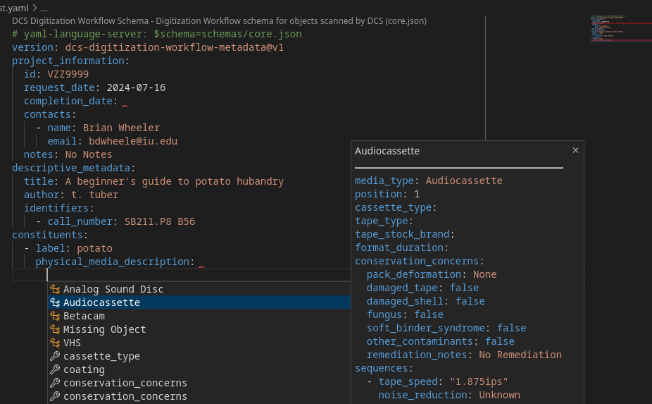

# DCS-workflow metadata thoughts
Metadata schemas and whatnot to support digitization

## HONKING BIG DISCLAIMER
This is really just a pie-in-the-sky proof of concept / thought experiment
kind of thing.  Its origins are likely related to a sleepless night after 
eating junk food right before I went to bed.  Curse you, Voortman vanilla 
wafers!

## Background

We have four major areas where we digitize content:
* Digitization Services:
    * Time-based media - uses the MDPI workflow tools
    * Image-based media - uses ImageProc and varous scripts
* BDPL for born-digital content - uses manual processes and scripts
* IULMIA for film - this is a new workflow that is TBD

### General Workflow Overview

All of our digitization workflows follow the same overall structure:
* Someone requests some things to get digitized and delivers the physical media
  along with some documentation describing the metadata, etc.
* The digitization specialist will...
    * prepare the media for digitization, which may include cleaning/repair
    * digitize the media and verify it looks or sounds "right"
    * process metadata is recorded (even if it is "this one is done")
    * the files are pushed to a server somewhere
    * return the materials to the requester
* Automated systems will...
    * run some technical QC checks
    * create derivatives (as needed)
    * distribute the derivatives (as needed)
    * store the data in a preservation / archive system

### Difficulties with the current approach

Right now the processes that we use for digitization, processing, distribution,
packaging, and metadata collection vary greatly between different projects,
media types, and sometimes within the same project.  Most of this is because
we've created one-off processes that were specific to the need at hand and they
became the "go to" system for far longer than the project's lifespan.

## Goals

Ideally we should have a human- and machine-readable record of how physical
media became a digital object that can be stored with the object in a 
preservation system for future reference.

## Scope
This primarily focused on these areas:
* Describing the structure of the physical media components comprising 
  the intellectual object
    * order and description of the physical media
    * purpose of the physical media ("performance program", and the like)
* Description of the physical media
    * Physical description (type, size, length, media vendor, etc)
    * Information required for successful playback (speed, groove size, etc)
* Conservation concerns
    * Inspection details (warping, damage, fungus, etc)
    * Conservation actions (baking, freezing, cleaning, etc)
* Digitization information
    * Equipment setup details (software configuration, signal chains, etc)
    * Basic information of the produced files (duration, color space, etc)
* Processing / Packaging / Distribution Information
    * Provide hints to derivative creation (such as "audio is on stream 3")
    * Override any automated QC checks for special cases
    * defer distribution to an access/preservation system, etc.
    * Processing logs, qc checks, etc will be collected

This information is explicitly **not in scope** except to support the 
functionality above:
* Descriptive metadata
    * Only the bare minimum metadata is used to identify the physical media
    * Identifiers can be included to refer to the system of record
* Ownership / Access control
    * Only supporting communicating with the owner and returning media
    * TBD:  processing hints?
* Details about the content
    * Only information relevant to creating/playing the digital copy is 
      allowed, such as "audio volume is low on source" but not "speech begins 
      at 3 minutes"

Details of the human workflow for digitization, such as project management or
tools used, are not prescriptive -- they are intended to be illustrative of
how in-scope functionality could fit into the bigger picture or to provide an 
example of how one could include this functionality.

The first pass of this concept is targeted directly at AV and Film digitization
since there is a desire to retire the MDPI workflow tools and IULMIA will be
adding a new Film scanner in the coming months.


## File Format Syntax 
There are many human- and machine-readable file formats available.  Limiting to
formats which are:
* text-based
* commonly used
* support validation schemas

For the format examples, let's assume we want to represent the audio and 
video streams in a media file:
* there's a list of streams:  a video stream, and an audio stream.
* for a video stream we need to store the codec, resolution, pixel format, and 
  frame rate.  ('ffv1', '640x480', 'yuv_p22le', '29.97')
* for an audio stream we need to store the codec, sample rate, and number of
  channels:  ('pcm_s24le', '44100', '1')
* assume there's some schema which defines the structure, that's identified
  as `https://dlib.indiana.edu/schemas/media_streams` that's specific to 
  whatever data format the example is for.  
* the structure is illustrative -- different data structures are possible.

A few formats fit those categories:
* XML - this has been used for years for all-manners of data interchange
    * Pros: Editors available.
    * Cons: Verbose.  (Potentially) hard to read outside an editor.  Schema
      definition is a bit obnoxious and hard to write.  Verbose.
    * Example: 
    ```
    <?xml version="1.0" encoding="utf-8"?>
    <media_streams xmlns="http://dlib.indiana.edu/schemas/media_streams">
        <streams>
            <stream>
                <type>video</type>
                <codec>ffv1</codec>
                <resolution>640x480</resolution>
                <pixfmt>yuv_p22le</pixfmt>
                <framerate>29.97</framerate>
            </stream>
            <stream>
                <type>audio</type>
                <codec>pcm_s24le</codec>
                <sample_rate>44100</sample_rate>
                <channels>1</channels>
            </stream>
        </streams>
    </media_streams>
    ```
* JSON - widely used for machine-to-machine communication
    * Pros:  Syntactically simple. Can represent core datatypes.  Widely used.
      Schemas aren't hard to create.
    * Cons:  Very picky on syntax.  Easy to accidentally render unreadable.
      Schemas are implicit but can be specified in applications.  Multiline-text requires escaping newline characters.  No comments.      
    * Example:
    ```
    {
        "media_streams": [
            {
                "type": "video",
                "codec": "ffv1",
                "resolution": "640x480",
                "framerate": 29.97
            },
            {
                "type": "audio",
                "codec": "pcm_s24le",
                "sample_rate": 44100,
                "channels": 1
            }
        ]
    }
    ```
* YAML - used for configuration files, documentation examples
    * Pros: Very easy to read - the most "plain text" of the formats here.  
      Proper JSON superset.  Can use JSON Schemas for validation. Syntax is
      generally pretty forgiving. 
    * Cons: Whitespace (both count and tabs vs space) is significant.  Some
      weird corner cases with schemas when the value is number-like and a 
      string is expected.  Schemas are implicit but can be specified in 
      applications.  Comments are lost when re-rendering.
    * Example:
    ```
    media_streams:
        - type: video
          codec: ffv1
          resolution: 640x480
          framerate: 29.97
        - type: audio
          codec: pcm_s24le
          sample_rate: 44100
          channels: 1
    ```

YAML and JSON share some properties which make them especially attractive:
* They can be converted losslessly between each other.  While YAML comments
  are lost in the process, the data is intact and structured correctly.
* The data they represent are directly analogous to common data structures
  in programming languages (strings, integers, float, boolean, lists, 
  maps) so they can be loaded and used directly.
* Since YAML is a proper superset of JSON, any application expecting YAML
  data will read JSON without modification.

Since all are equally machine-usable, human-usablility is a major factor and
YAML comes out a clear winner. The remainder of this document will use YAML.

### Manually Editing a YAML Document

One can edit a YAML document in any text editor, but there are some caveats:
* Indentation is the structure -- so having an editor that indicates the amount
  of indentation is important, especially on deeply-nested structures.
* Tabs and spaces are not the same.  8 spaces isn't the same as a single tab.
  It is best to use an editor which doesn't insert tab (ASCII 09) characters
  into the document but instead inserts the correct number of spaces to align
  the text.  `emacs` is terrible about "optimizing" text and inserting tabs.
* If there is a schema available, using an editor which validates the document
  as it is being typed is useful.  

Everything but schema support is supplied by Visual Studio Code and when the
RedHat-supplied YAML Language Support extension is installed it gains
schema support.  Validation errors show up as the document is edited and 
CTRL+space can be used for auto completion.

For example, with an empty document (except the schema association), the
skeleton of the file can be populated (with defaults):


and valid values can be expanded with CTRL+space:


The red squiggles are visual clues that the there is missing or improperly
formatted content, and the filename tab will also indicate that the file has
validation errors.


## Schema Definition

Schemas that can be applied to YAML and JSON data can be defined using JSON
schema.  The schema is used to validate that the file conforms to what is 
expected and it can also be used by tools to provide hints for structure,
valid values, etc.

This repository has a sample schema for several A/V


-- todo here -- 


## Digitization Workflow Process

NOTE:  Any YAML examples here are based on the schema as it exists at the time
this was written.  The schemas will change as more details are fleshed out.


### The request
A request for digitization should include information about the intellectual
object(s) that need to be digitized.  In addition to basic metadata (such as
title), these things should be present (if possible):
* Identifiers for the intellectual object, such as IUCAT barcode, catkey,
  call number, or a locally-scoped identifier (i.e. something off the 
  spreadsheet)
* Information about the physical objects which make up the intellectual object
  including indentification information (such as label text or barcode), and
  an indication which order multiple objects should be presented.  For example,
  "the tape labeled '342' should be first, 'a13' should be second".  
  Additionally, if there are any missing items, they should be identified 
  ("part 3 is missing")
* The media to be digitized :)

The example will be a simple one:
* title: "A beginner's guide to potato hubandry", author: "t. uber"
* a single audiocassette with a case labeled "potato"
* call number SB211.P8 B56


### Set up a project environment
Every digitization project will need an ID -- it could be a VA number or some
other identifier.  We'll use `VZZ9999` as the ID.

The person doing the digitization will create a project directory in whatever
workspace is assigned.  For an AV digitization, the space is on capybara and
the directory will be named the same as the identifier.  So the directory is
also named `VZZ9999`

A skeleton digitization metadata file is copied into the workspace which a
name that includes the identifier.  The skeleton would be saved as 
`VZZ9999-project.yaml` and look something like this:

```
# yaml-language-server: $schema=schemas/core.json
version: dcs-digitization-workflow-metadata@v1
project_information:
  id: 
  request_date: 
  completion_date: 
  contacts:
    - name: 
      email: 
  notes: No Notes
descriptive_metadata:
  title: 
  author: 
  identifiers:
    - 
constituents:
  - label: 
    physical_media_description: 
```
and filling out the bits from the project request:

```
# yaml-language-server: $schema=schemas/core.json
version: dcs-digitization-workflow-metadata@v1
project_information:
  id: VZZ9999
  request_date: 2024-07-16
  completion_date: 
  contacts:
    - name: Brian Wheeler
      email: bdwheele@iu.edu
  notes: No Notes
descriptive_metadata:
  title: A beginner's guide to potato hubandry
  author: t. tuber
  identifiers:
    - call_number: SB211.P8 B56
constituents:
  - label: potato
    physical_media_description: 
```
The completion date remains empty and the label for the first constituent object
has been set ("potato").


### Digitizing the Object

The physical media is an audiocassette, so moving the cursor below the 
physical_media_description field and indenting, CTRL-space lets us select
the audiocassette information



Selecting it extends the file appropriately:

```
# yaml-language-server: $schema=schemas/core.json
version: dcs-digitization-workflow-metadata@v1
project_information:
  id: VZZ9999
  request_date: 2024-07-16
  completion_date: 
  contacts:
    - name: Brian Wheeler
      email: bdwheele@iu.edu
  notes: No Notes
descriptive_metadata:
  title: A beginner's guide to potato hubandry
  author: t. tuber
  identifiers:
    - call_number: SB211.P8 B56
constituents:
  - label: potato
    physical_media_description: 
      media_type: Audiocassette
      position: 1
      cassette_type: 
      tape_type: 
      tape_stock_brand: 
      format_duration: 
      condition_evaluation:
        pack_deformation: None
        damaged_tape: false
        damaged_shell: false
        fungus: false
        soft_binder_syndrome: false
        other_contaminants: false
        remediation_notes: No Remediation
      sequences:
        - id: 
          tape_speed: "1.875ips"
          noise_reduction: Unknown
          sound_field: 
          duration: 
          notes: No Notes
```

There's only one tape, so the position '1' is correct.  The tape overall tape
information is noted:

```
    physical_media_description: 
      media_type: Audiocassette
      position: 1
      cassette_type: Compact
      tape_type: I
      tape_stock_brand: Scotch
      format_duration: 90 min
      condition_evaluation:
        pack_deformation: None
        damaged_tape: false
        damaged_shell: true
        fungus: false
        soft_binder_syndrome: false
        other_contaminants: false
        remediation_notes: Taped the shell together
```

The digitization for side 1 is performed using industry-standard tools and 
settings are noted:
```
        - id: side 1
          tape_speed: "1.875ips"
          noise_reduction: Unknown
          sound_field: stereo
          duration: 22:30
          notes: Recurring popping on the left channel
```
and the media file is named appropriately and put into the project directory.

Side 2 is handled similarly

The digitizer will do any visual/listening QC work to make sure the content is
what is expected.

Now the digitization is complete and the "completion_date" field is filled out.

TBD:  
* mapping objects and sequences to filenames, and filename conventions 
  generally.  Maybe the names are literally specified in the sequence itself?
* need some place to hang signal chain information
* need a place to put who did the digitization

### Processing the object

When the digitization is finished the project directory is moved to a processing
dropbox.

The processing system will look at the project file and:
* validate the project file, both against the schema and for consistency
* make sure all the files are there
* do any format-specific automatic QC for the file formats


