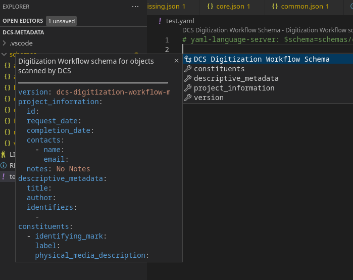
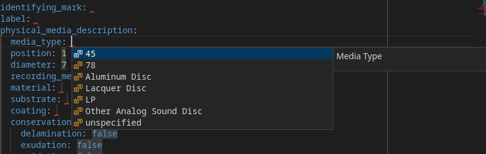

There are many human- and machine-readable file formats available.  Limiting to
formats which are:
* text-based
* commonly used
* support validation schemas

For the format examples, let's assume we want to represent the audio and 
video streams in a media file:
* there's a list of streams:  a video stream, and an audio stream.
* for a video stream we need to store the codec, resolution, pixel format, and 
  frame rate.  ('ffv1', '640x480', 'yuv_p22le', '29.97')
* for an audio stream we need to store the codec, sample rate, and number of
  channels:  ('pcm_s24le', '44100', '1')
* assume there's some schema which defines the structure, that's identified
  as `https://dlib.indiana.edu/schemas/media_streams` that's specific to 
  whatever data format the example is for.  
* the structure is illustrative -- different data structures are possible.

A few formats fit those categories:
* XML - this has been used for years for all-manners of data interchange
    * Pros: Editors available.
    * Cons: Verbose.  (Potentially) hard to read outside an editor.  Schema
      definition is a bit obnoxious and hard to write.  Verbose.
    * Example: 
    ```
    <?xml version="1.0" encoding="utf-8"?>
    <media_streams xmlns="http://dlib.indiana.edu/schemas/media_streams">
        <streams>
            <stream>
                <type>video</type>
                <codec>ffv1</codec>
                <resolution>640x480</resolution>
                <pixfmt>yuv_p22le</pixfmt>
                <framerate>29.97</framerate>
            </stream>
            <stream>
                <type>audio</type>
                <codec>pcm_s24le</codec>
                <sample_rate>44100</sample_rate>
                <channels>1</channels>
            </stream>
        </streams>
    </media_streams>
    ```
* JSON - widely used for machine-to-machine communication
    * Pros:  Syntactically simple. Can represent core datatypes.  Widely used.
      Schemas aren't hard to create.
    * Cons:  Very picky on syntax.  Easy to accidentally render unreadable.
      Schemas are implicit but can be specified in applications.  Multiline-text requires escaping newline characters.  No comments.      
    * Example:
    ```
    {
        "media_streams": [
            {
                "type": "video",
                "codec": "ffv1",
                "resolution": "640x480",
                "framerate": 29.97
            },
            {
                "type": "audio",
                "codec": "pcm_s24le",
                "sample_rate": 44100,
                "channels": 1
            }
        ]
    }
    ```
* YAML - used for configuration files, documentation examples
    * Pros: Very easy to read - the most "plain text" of the formats here.  
      Proper JSON superset.  Can use JSON Schemas for validation. Syntax is
      generally pretty forgiving. 
    * Cons: Whitespace (both count and tabs vs space) is significant.  Some
      weird corner cases with schemas when the value is number-like and a 
      string is expected.  Schemas are implicit but can be specified in 
      applications.  Comments are lost when re-rendering.
    * Example:
    ```
    media_streams:
        - type: video
          codec: ffv1
          resolution: 640x480
          framerate: 29.97
        - type: audio
          codec: pcm_s24le
          sample_rate: 44100
          channels: 1
    ```

YAML and JSON share some properties which make them especially attractive:
* They can be converted losslessly between each other.  While YAML comments
  are lost in the process, the data is intact and structured correctly.
* The data they represent are directly analogous to common data structures
  in programming languages (strings, integers, float, boolean, lists, 
  maps) so they can be loaded and used directly.
* Since YAML is a proper superset of JSON, any application expecting YAML
  data will read JSON without modification.

Since all are equally machine-usable, human-usablility is a major factor and
YAML comes out a clear winner. The remainder of this document will use YAML.

### Manually Editing a YAML Document

One can edit a YAML document in any text editor, but there are some caveats:
* Indentation is the structure -- so having an editor that indicates the amount
  of indentation is important, especially on deeply-nested structures.
* Tabs and spaces are not the same.  8 spaces isn't the same as a single tab.
  It is best to use an editor which doesn't insert tab (ASCII 09) characters
  into the document but instead inserts the correct number of spaces to align
  the text.  `emacs` is terrible about "optimizing" text and inserting tabs.
* If there is a schema available, using an editor which validates the document
  as it is being typed is useful.  

Everything but schema support is supplied by Visual Studio Code and when the
RedHat-supplied YAML Language Support extension is installed it gains
schema support.  Validation errors show up as the document is edited and 
CTRL+space can be used for auto completion.

For example, with an empty document (except the schema association), the
skeleton of the file can be populated (with defaults):



and valid values can be expanded with CTRL+space:



The red squiggles are visual clues that the there is missing or improperly
formatted content, and the filename tab will also indicate that the file has
validation errors.


## Schema Definition

Schemas that can be applied to YAML and JSON data can be defined using JSON
schema.  The schema is used to validate that the file conforms to what is 
expected and it can also be used by tools to provide hints for structure,
valid values, etc.

This repository has a sample schema for several A/V

